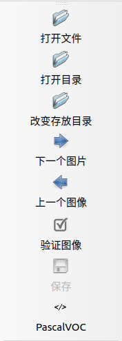

# 目标检测数据集处理
这是一个目标检测预处理的说明稳定

## 功能
- [x] VOC -> yolo
- [x] [yolo -> coco](#yolo-to-coco): 转化为 COCO 数据集用于 [ultralytics/yolov5](https://github.com/ultralytics/yolov5) 项目


## 数据集制作

> 需要说明的是，脚本只能按照标注进行分类的数据进行处理，如果一张图片有多个标注，是无法处理的     
> 该项目仅仅是脚本库，不包括数据集

### 数据采集与归档

将采集到的数据放置在 `dataset-custom/src` 目录下面，并且按照类别归档至对应文件夹下，参考的文件目如下

数据集目录结构如下
```bash
·
└── objdect-dataset # 数据集目录
    ├── src         # 原始数据，按照类别进行归档
    │   ├─ A        # 类别 A
    │   ├─ B
    │   └─ ...
    ├── labeled     # 压缩、重命名后的文件，在这里进行标注
    ├── VOC         # VOC 标准数据集，用于训练
    └── coco        # coco 标准数据集，用于训练
```
> `labeled` 目录是用于后续步骤[数据标注](#数据标注)的目录，这样我们可以在不破坏原始数据对情况下完成数据处理，如果不再需要原始数据，在完成此步骤后，可以删除 `src` 目录

数据集的图片的大小不能太大，需要预先压缩尺寸，执行 `objdet_dataset_processor/resize.py`
```bash
python3 objdet_dataset_processor/resize.py [--dataset-path] [--height] [--is_rename]
# example
python3 objdet_dataset_processor/resize.py -d ~/data/objdect-dataset --is_rename
```


### 数据标注

在前面步骤中生成的 `labeled` 目录是用于数据标注的目录，选择图像注释工具 labelImg 进行标注。

[labelImg](https://github.com/tzutalin/labelImg) 是 Python 编写、基于 Qt 图形界面的软件，标注以 PASCAL VOC 格式（ImageNet 使用的格式）另存为 `.xml` 文件。此外，它还支持 YOLO 格式。

你可以通过从[源码编译](https://github.com/tzutalin/labelImg)的方式安装，也可以通过 pip3 快速安装
```bash
pip install labelImg
```

安装后，可以在命令行启动
```bash
labelImg
```

在 Ubuntu 下启动后的界面如下（Windows 版本可能略有差异）


<!--  -->

- 打开文件 : 标注单张图像（不推荐使用）
- **打开目录** : 打开数据集存放的目录，目录下应该是图像的位置
- **改变存放目录**: 标注文件 `.xml` 存放的目录
- 下一个图片: 
- 上一个图像: 
- **验证图像**: 验证标记无误，用于全部数据集标记完成后的检查工作
- **保存**: 保存标记结果，快捷键 `Ctrl+s`
- **数据集格式**: `PascalVOC` 和 `YOLO` 可选，一般选择 `PascalVOC` 即可，需要 `YOLO` 可以之后进行转换

点击 `创建区块` 创建一个矩形框，画出范围


每个类别都有对应的颜色加以区分


完成一张图片的标注后，点击 `下一个图片`

- labelImg 快捷键

| 快捷键 |           功能           | 快捷键 |       功能       |
| :----: | :----------------------: | :----: | :--------------: |
| Ctrl+u |    从目录加载所有图像    |   w    |  创建一个矩形框  |
| Ctrl+R |   更改默认注释目标目录   |   d    |    下一张图片    |
| Ctrl+s |     保存当前标注结果     |   a    |    上一张图片    |
| Ctrl+d |   复制当前标签和矩形框   |  del   | 删除选定的矩形框 |
| space  |  将当前图像标记为已验证  | Ctrl+  |       放大       |
|  ↑→↓←  | 键盘箭头移动选定的矩形框 | Ctrl–  |       缩小       |


## 数据集预处理

### 转换至可训练的标准数据集
当标注完成后，我们就需要将图像和标注文件转换为我们所需要的数据格式

可用的转换流程如下
```bash
labeled -> VOC  # to PASCAL VOC
            └─> YOLO -> COCO  # to YOLOv5 COCO
```
- [x] [转换成 VOC 格式](#转换成-VOC-格式)
- [x] [转换成用于 YOLOv5 的 COCO 格式](#转换成用于-YOLOv5-的-COCO-格式)


#### 转换成 VOC 格式

<!-- **VOC2012** 数据集描述：
- **Annotations**: 存放了数据`xml`格式存储的标签，里面包含了每张图片的`bounding box`信息，主要用于**目标检测**。
- **ImageSets**: ImageSets中的Segmentation目录下存放了用于分割的train, val, trainval数据集的索引。
- **JPEGImages**: 这里存放的就是JPG格式的原图，包含17125张彩色图片，但只有一部分(2913张)是用于分割的。
- **SegmentationClass**: 语义分割任务中用到的label图片，PNG格式，共2913张，与原图的每一张图片相对应。
- **SegmentationObject**: 实例分割任务用到的label图片，在语义分割中用不到，这里不详解介绍。
--- -->

转换成 VOC 数据集流程如下
```bash
labeled -> VOC  # to PASCAL VOC
```

执行 `labeled-voc.py` 将已经标记好的数据集转化成VOC格式
```bash
python3 scripts/dataset/labeled-voc.py [--dataset-path] [--height] [--is_rename]
# example
python3 scripts/dataset/labeled-voc.py
```

运行后会在 VOC 目录下类别文件 `classes.names` 和训练集文件 `train.txt` 、验证集文件 `val.txt`
```bash
·
└── dataset-custom  # 数据集文件夹
    ├── src         # 原始数据，按照类别进行归档
    ├── labeled     # 压缩、重命名后的文件，在这里进行标注
    └── VOC         # VOC 标准数据集，用于训练
        ├── Annotations
        ├── ImageSets
        │   └── Main
        │       ├── classes.names
        │       ├── train.txt
        │       └── val.txt
        └── JPEGImages            
```


#### 转换成用于 YOLOv5 的 COCO 格式
```bash
VOC -> YOLO -> COCO  # to YOLOv5 COCO
```


执行 `voc-yolo.py` 将数据集从 VOC 转换成 YOLO
```bash
python3 scripts/dataset/voc-yolo.py [--conf]
```

执行 `yolo-coco.py` 将数据集从 YOLO 转换成 COCO (yolov5)
```bash
python3 scripts/dataset/yolo-coco.py [--conf]
```

运行后得到 YOLOv5 的 COCO 数据集，包含 `images`,`labels` 目录，目录下分别包含子目录 `train`,`val` 
```bash
·
└── dataset-custom  # 数据集文件夹
    ├── src         # 原始数据，按照类别进行归档
    ├── labeled     # 压缩、重命名后的文件，在这里进行标注
    └── coco        # coco 数据集，用于训练
        ├── images
        │   ├── train
        │   └── val
        └── labels   
            ├── train
            └── val
```

## 相关仓库

- [labelImg](https://github.com/tzutalin/labelImg): 用于目标检测数据的图像标注软件